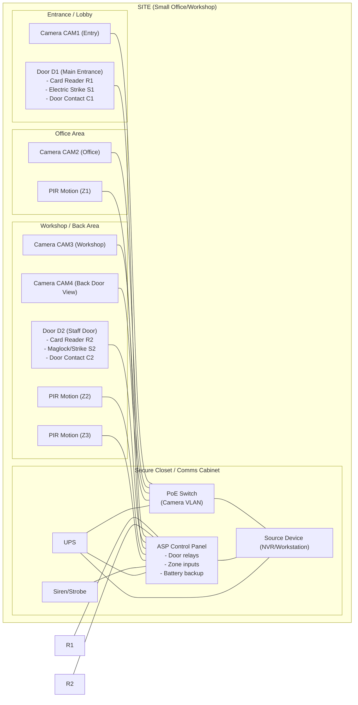

# Exercise 3 — ASP System Design

**Opening date:** Wednesday, November 26, 2025, 3:00 PM  
**Required by:** Wednesday, January 21, 2026, 11:59 PM  

## 1) Source device (computer): specification + justification

### Selected source device
**Type:** Dedicated security workstation / NVR (Network Video Recorder) PC  
**Role in ASP system:** Central “source device” used for:
- Live monitoring (operator console)
- Recording and playback of CCTV footage
- Event logging (alarms, access events)
- Hosting the management software (VMS + access control UI)
- Exporting incident reports and evidence

### Minimum specification (recommended baseline)
- **CPU:** Intel Core i5 / AMD Ryzen 5 (6 cores or better)
- **RAM:** 16 GB (32 GB recommended if many cameras / analytics)
- **Storage:**
  - OS drive: 500 GB SSD
  - Recording drive: 8 TB surveillance-grade HDD (expandable; RAID optional)
- **Network:** Dual 1 GbE (one for camera VLAN, one for office/LAN) or 1× 2.5 GbE
- **Display:** Dual-monitor support (e.g., 2× 24" 1080p)
- **Power:** 650–1000 VA UPS (for safe shutdown + short outage coverage)
- **OS/Software:** Windows 11 Pro or Ubuntu LTS + compatible VMS/access software

### Justification
- **Centralized evidence handling:** A dedicated workstation ensures continuous recording and secure storage of footage and logs.
- **Performance and reliability:** SSD for OS and HDD/RAID for recording improves uptime and reduces dropped frames.
- **Network segregation:** Dual NIC/VLAN support reduces risk (camera network isolated from user network).
- **Maintainability:** A standard PC platform is easy to upgrade (storage, RAM) and service locally.

---

## 2) Control system: specification + justification

### Selected control system architecture
**Type:** Access + alarm control panel (hybrid ASP controller) with network connectivity  
**Examples (acceptable equivalents):** HID/Lenel-style access controller, DSC/Paradox/Honeywell alarm panel, or a combined system that supports door control + zones + outputs.

### Control system specification (functional)
- **Inputs (zones):**
  - Door contact sensors (reed switches)
  - Motion detectors (PIR)
  - Glass-break sensor (optional)
  - Manual panic button (optional)
- **Outputs:**
  - Door strike / maglock relay control (fail-safe/fail-secure as required)
  - Siren / strobe outputs
  - Auxiliary outputs for lighting or camera trigger
- **Access control:**
  - 2-door controller minimum (expandable to 4–8 doors)
  - Card reader support (RFID) and/or keypad + card (2FA)
  - Scheduling (business hours), holidays, and role-based access
- **Communications:**
  - Ethernet (preferred) with encrypted management interface
  - Optional LTE/GSM module for alarm reporting backup
- **Power:**
  - 12 VDC/24 VDC regulated supply
  - Battery backup inside panel enclosure (7–18 Ah)
- **Safety and compliance considerations:**
  - Egress requirements (request-to-exit button/sensor)
  - Fire alarm integration where required (door release on fire event)

### Justification
- **Deterministic control:** A dedicated panel provides reliable door/zone handling even if the PC software is offline.
- **Security:** Panels can be installed in locked enclosures, with tamper monitoring and battery backup.
- **Scalability:** Adding doors/zones is straightforward with expansion modules.
- **Separation of concerns:** The panel handles real-time control; the workstation handles monitoring, reporting, and video evidence.

---

## 3) Cost estimate (bill of materials)

### Assumptions for estimating
This estimate is sized for a **small site** (e.g., small office/workshop) with:
- 4 IP cameras (PoE)
- 2 controlled doors (main entrance + staff door)
- 6 intrusion zones (contacts + PIRs)
- Basic network cabinet and cabling

> Prices are typical retail/installer-level ranges in USD. Substitute your local currency if required.

### Itemized estimate (equipment)
| Category | Qty | Unit Cost (USD) | Ext. Cost (USD) | Notes |
|---|---:|---:|---:|---|
| NVR/Workstation PC (i5/R5, 16GB, SSD) | 1 | 700 | 700 | Management + recording host |
| 8 TB surveillance HDD | 1 | 160 | 160 | Recording storage |
| UPS (900 VA) | 1 | 150 | 150 | Runtime + graceful shutdown |
| 24" monitors | 2 | 120 | 240 | Operator console |
| IP PoE cameras (4–8 MP) | 4 | 90 | 360 | Fixed dome/bullet |
| PoE switch (8-port) | 1 | 110 | 110 | Cameras + headroom |
| Controller panel (2-door + alarm zones) | 1 | 450 | 450 | Hybrid or integrated solution |
| Card readers | 2 | 70 | 140 | Entry + staff door |
| Credential cards/fobs | 20 | 3 | 60 | Users/visitors |
| Electric strike / maglock | 2 | 120 | 240 | Door locking hardware |
| Door contact sensors | 2 | 10 | 20 | Door state monitoring |
| PIR motion sensors | 4 | 20 | 80 | Intrusion detection |
| Siren/strobe | 1 | 50 | 50 | Audible/visual alarm |
| Backup battery (panel) | 1 | 35 | 35 | 12 V sealed lead-acid |
| Network cabinet + patch accessories | 1 | 120 | 120 | Small wall cabinet |
| Cabling/consumables (Cat6, conduits, connectors) | 1 | 200 | 200 | Estimate lump sum |
| **Estimated equipment total** |  |  | **2,915** |  |

### Optional/variable costs (common add-ons)
| Option | Typical Cost (USD) | Why/When |
|---|---:|---|
| VMS software license (if not free) | 0–300 | Some VMS is free; advanced features cost |
| Cloud backup for clips | 5–30/month | Off-site evidence retention |
| LTE/GSM alarm communicator | 120–250 + plan | Backup reporting if internet fails |
| RAID (extra HDD) | +160–320 | Higher reliability for recordings |
| Additional cameras | +90–180 each | More coverage |

### Labor (if installer-priced)
Labor varies widely by region and site conditions. A simple budgeting approach:
- **Installation/configuration labor:** 8–24 hours
- **Typical rate:** \$40–\$120/hour
- **Estimated labor range:** **\$320–\$2,880**

### Grand total (budget range)
- **Equipment:** ~**\$2,915**
- **With labor (range):** ~**\$3,235–\$5,795** (plus any monthly services)

---

## 4) Site drawing (key components of the ASP system)

### Site drawing (logical + physical layout)
The diagram below shows a simple site with two controlled doors, four cameras, intrusion sensors, and the controller panel/network equipment in a secure closet.

### Key components checklist (as required)
- **Source device (computer):** NVR/Workstation (`PC`)
- **Control system:** ASP control panel (`PANEL`)
- **Detection devices:** PIRs, door contacts (Z1–Z3, C1–C2)
- **Access devices:** card readers + locks (R1–R2, S1–S2)
- **Alarm annunciation:** siren/strobe
- **CCTV:** CAM1–CAM4 over PoE switch
- **Power resilience:** UPS + panel battery
- **Networking:** PoE switch, segmented camera network recommended

